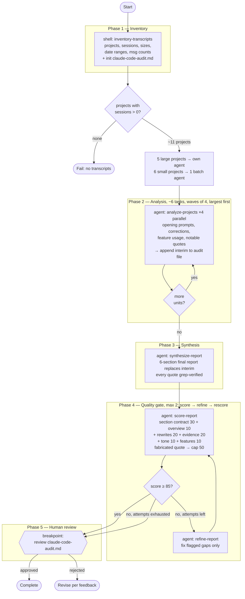

# claude-usage-audit — flow diagram

## Task inventory

| Task | Kind | Fan-out |
|------|------|---------|
| `inventory-transcripts` | shell | 1 |
| `analyze-projects` | agent (general-purpose) | ~6 (5 large + 1 small batch, waves of 4) |
| `synthesize-report` | agent | 1 |
| `score-report` | agent | 1–2 |
| `refine-report` | agent | 0–1 |
| final review | breakpoint | 1 |
